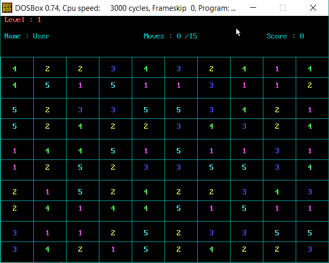
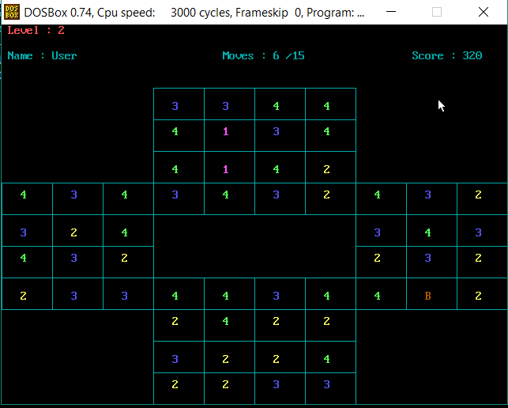
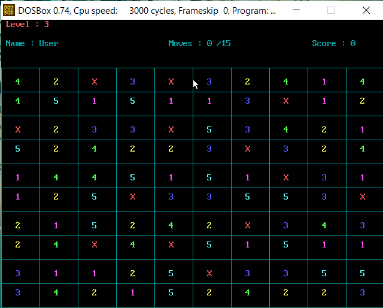

# NumberCrush
An implementation of the classic match and destroy game with graphics in Assembly Language.
The game consists of 3 different levels with increasing difficulty

## Level: 1

## Level: 2

## Level: 3

